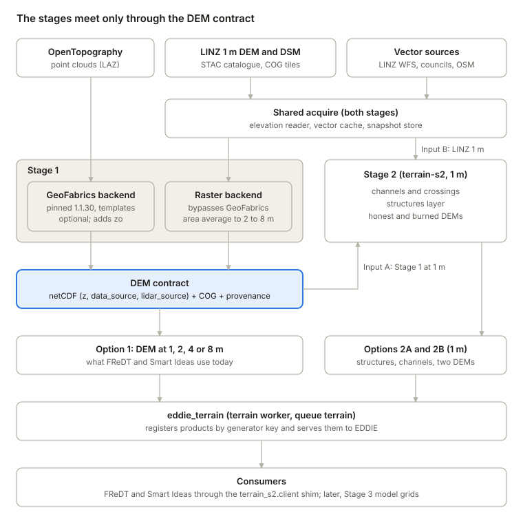
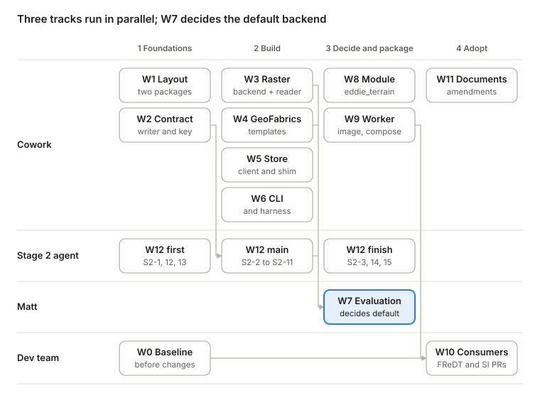

# EDDIE Terrain — Revised Stage 1 and Stage 2 Integration Plan

Oct 9, 2026 · @Matt

## 1. Purpose and how to use this document

This plan replaces the NewZeaLiDAR-based route of `EDDIE_terrain_stage1_geofabrics.md` (Document 2). It does three things:

- builds Stage 1 as a thin EDDIE module over an unmodified, pinned GeoFabrics;
- adds a raster route that bypasses GeoFabrics;
- defines the minor changes Stage 2 (`terrain-s2`) needs so that it runs on either the Stage 1 DEM or the LINZ DEM.

At the end of the work, EDDIE can provide:

1. **A Stage 1 DEM** at a specified integer resolution, from the LINZ 1 m DEM (`raster` backend) or from point clouds via GeoFabrics 1.1.30 (`geofabrics` backend).
2. **Stage 2 products:** culverts and other structures, drains and streams, and an honest and a burned 1 m DEM. Stage 2 runs on either the Stage 1  1 m DEM (Input A) or the LINZ 1 m DEM directly (Input B). Input B bypasses Stage 1 entirely; the two stages share input acquisition.

Model grids at other resolutions from Stage 2 products are deferred to a later Stage 3.

**Two readers.**

- **The Cowork implementation session** follows sections 4–6 and 9–12. It works the packages in section 11 in order, with the exit criteria given there.
- **The Stage 2 agent** follows section 7 (adjustments to `terrain-s2`) and section 8 (structures layer and conditioning). It needs sections 4 and 5 for context, and nothing in Stage 2 may import Stage 1 code.

**Conventions.**

- Item numbers S2-1 to S2-15 (section 7) and work packages W1 to W12 (section 11) are stable identifiers; use them in commits and notes.
- Commands for the user's workstation are written for PowerShell.
- Data live outside the repository and outside OneDrive, located by configuration.
- This document supersedes Document 2 S1.1, S1.2 and S1.5 where they conflict. Document 2 remains the reference for S1.0, S1.3, S1.4, S1.7 and S1.8, as amended here.

## 2. Decisions record

These decisions were taken in the planning thread of 9 October 2026. Implementation follows them unless the team reopens one.

| ID | Decision | Consequence |
| --- | --- | --- |
| P-1 | Start from the GeoFabrics codebase, unmodified. Pin `geofabrics==1.1.30` and drive it only through `runner.from_instructions_dict` with instruction templates held as data. | Updating the chain = bump the pin or edit a template, then run the regression harness (W6). Fixes go upstream (section 13), or are done before and after GeoFabrics in our code. |
| P-2 | GeoFabrics runs in a **separate terrain worker**: its own image and environment, Celery queue `terrain`. | FReDT and Smart Ideas need no geospatial stack upgrade for terrain. They call terrain by task name and read results through a light client. |
| P-3 | The LINZ 1 m DEM (raster) route **bypasses GeoFabrics**. The library writes the same output contract itself. | The default path has no GeoFabrics dependency. The Document 2 S1.5 caveats (grid snapping, the hard-coded offshore clip for coarse DEMs, linear-interpolation aliasing) do not apply. |
| P-4 | **NewZeaLiDAR is retired now.** No consolidation under GeospatialResearch. | Document 2 S1.1–S1.2 are replaced. v5 D10 and its v5.0.0 minimum are amended (section 13). A compatibility shim keeps FReDT and Smart Ideas call sites working. |
| P-5 | The GeoFabrics backend is likely optional rather than the default. The default is decided by the quality evaluation (W7). | TR-3 is answered by data. |
| P-6 | Stage 2 is self-contained. It runs on Input A (Stage 1 1 m DEM) or Input B (LINZ 1 m DEM), and shares input acquisition with Stage 1. | The only link between the stages is a file contract (section 4.3). |
| P-7 | A **structures layer** records all structures. Burning a culvert into the DEM is user-configurable, driven mainly by the width of the channel through the barrier. A burned culvert behaves as an open channel and overstates conveyance. | Section 8. |
| P-8 | Stage 2 produces **both** an honest DEM and a burned DEM (design §6.1). | Section 8.2. |
| P-9 | How EDDIE receives Stage 2 results on the LINZ DEM is **not yet decided**. Likely: a precomputed default where available, alternative versions on demand. It depends on hosting, because the national dataset is large. | Outputs are written per LINZ tile, keyed by tile, inputs, code and parameters, so both delivery routes stay open (section 7, S2-8). |
| P-10 | Model grids at specified resolutions from Stage 2 products are a later **Stage 3**. | Stage 2 stops at 1 m. Stage 1 keeps simple area averaging for option 1 only. |
| P-11 | Smart Ideas' `8m_geofabric.nc` and `4m_geofabric.nc` were produced by NIWA on an unknown GeoFabrics version, with no instructions available. | They are a qualitative reference only. Acceptance compares downstream results and records our own instructions (W10). |

Defaults assumed unless changed:

- library working name `terrain_s2`, until TR-5 names it;
- LiDAR classes `[2]`, for parity (TR-9 deferred);
- `data_source = 5` in the raster route;
- no publication of DEMs to GeoServer.

## 3. Verified starting state

GeoFabrics 1.1.30 already does most of what NewZeaLiDAR wraps, so a thin wrapper over its runner is enough. The repositories were inspected on 9 October 2026.

| Repository | Revision | Relevance |
| --- | --- | --- |
| `rosepearson/GeoFabrics` | `main` @ `1ad676f` (12 Mar 2026), version 1.1.30; on PyPI since 18 May 2026 | The pinned chain |
| `niwa/geoapis` | 0.3.4 | LiDAR discovery and download for GeoFabrics |
| `LukeParky/NewZeaLiDAR` | `update_sqlalchemy` @ `4b13f20` | Production line, retired |
| `xandercai/NewZeaLiDAR` | `main` @ `f7e00a1` | Reference for the GeoFabrics 1.x adaptation |
| `GeospatialResearch/eddie_floodresilience` | `main` @ `c5653ab` | FReDT, consumer |
| `GeospatialResearch/FReDT-Smart-Ideas` | `main` @ `b18b443` | Smart Ideas, consumer |
| `GeospatialResearch/Digital-Twins` | `master` @ `d366e75`; `v5-integration` @ `5cb3880` (8 Oct) | Core, v4 and v5 |
| `MatthewDWilson/terrain-s2` | `main` @ `04d3107` (9 Oct); 82 tests pass, 8 skipped | Stage 2; becomes the terrain library |

### 3.1 GeoFabrics 1.1.30

- **Runner.** `runner.from_instructions_dict` runs the stages `measured`, `rivers`, `waterways`, `stopbanks`, `dem` (raw then hydrologic), `roughness` and `patch`. It merges a `default` block into each stage, and skips the raw and result DEM steps when their files exist.
- **LiDAR.** Through `geoapis.lidar.OpenTopography`, it queries the OpenTopography `otCatalog` API for datasets in the AOI. It downloads only the tiles needed from the `pc-bulk` S3 bucket, using each dataset's tile index, and caches them under `downloads/lidar`.
- **Survey priority.** Datasets are ordered by their value in `dataset_mapping.lidar` (1 = highest priority). With several datasets, a mapping must be supplied.
- **Dataset CRS.** Taken from the instructions if given, otherwise from the LAZ headers.
- **Roughness.** `RoughnessLengthGenerator` (`zo`) uses LiDAR point heights, so it needs point clouds. PR #281 adds roughness from land use.

### 3.2 NewZeaLiDAR: what it adds

- Selects the datasets covering the AOI and ranks them newest first. That ranking becomes `dataset_mapping`.
- Generates instructions per AOI and injects LINZ layer 51153 as the land polygon.
- Registers DEMs in `user_dem` and `hydro_dem`, reuses a stored DEM that contains the AOI, and clips it.
- Provides the lookup functions FReDT calls.

Three weaknesses:

- Its scrapy crawler of OpenTopography duplicates `otCatalog` and broke in April 2024.
- It forces EPSG:2193+7839 on every survey.
- `clip_dem` writes `{index}_raw.nc` but records `{index}_raw_dem.nc`.

### 3.3 FReDT and Smart Ideas

- **Shared call path.** `flood_model/process_hydro_dem.py` is byte-identical in both. The call sites to preserve are:
  - `newzealidar.process.main(gdf)`, `newzealidar.datasets.main()` and `newzealidar.utils.map_dataset_name(conn, file)`;
  - `get_dem_band_and_resolution_by_geometry(conn, gdf)`, in `process_hydro_dem.py` and `river_inflows.py`;
  - `get_dem_by_geometry(conn, gdf)`, in `bg_flood_model.py`.

  `align_rec_osm.py` and `river_network_for_aoi.py` reach the DEM through `process_hydro_dem`.
- **Resolution parsing.** `get_dem_band_and_resolution_by_geometry` parses the resolution from the last token of the netCDF `description` attribute with `int()`.
- **Start-up and refresh.** FReDT's `on_startup` sends `ensure_lidar_datasets_initialised`, which crawls OpenTopography on first start. `blueprint.py` exposes `refresh_lidar_data_sources`.
- **Task chain.** `create_model_for_area` chains `add_base_data_to_db | process_dem | generate_tide_inputs | generate_river_inputs | run_flood_model | cache_results`.
- **Smart Ideas modelling path.** It reads `$HYDROMT_PATH/river_data/<river>/8m_geofabric.nc` and `4m_geofabric.nc`, with layers `z` and `zo`. Consumers: BG-Flood, LISFLOOD-FP (roughness split, Strahler order), and the Wflow preparation. Nothing in the repository produces these files.
- **Environments.** GDAL 3.7.0, rasterio 1.3.8, geopandas 0.14.4, pygeos 0.14, PDAL 3.2.3, Python ≥ 3.11.

### 3.4 EDDIE core

`v5-integration` holds the WP1 merges (`antarctica-base`, `fredt-smart-idea-skeleton`, graticules). It still has:

- plugin discovery by the `eddie_` prefix: `app.py` imports `<name>.blueprint`, and `tasks.py` imports `<name>.tasks` for every installed plugin;
- the v4 cache signature `(polygon, options)`.

D3 (generic cache) and D6 (entry points, `processes`) have not landed.

### 3.5 terrain-s2 (Stage 2)

The algorithm core is CRS-agnostic and its parameters are in metres. Acquisition records STAC checksums. A national partition into LINZ 1:10k tiles exists. A full tile runs in about 16 min on CPU, with a peak of 8.65 GB.

Gaps for the end state:

- orchestration lives in `scripts/run_network.py`;
- no modified DEM is produced;
- `rasterio.open()` on a netCDF returns 0 bands (tested), so Stage 1 output can't be read;
- vector outputs are not owned per tile;
- the elevation reader takes one survey per window;
- base dependencies are heavy.

Section 7 lists the fixes.

## 4. Target architecture

Three routes produce the products. They share one reader, one cache and one output contract. Stage 2 never imports Stage 1.



Stage 2 reads either the LINZ DEM through the shared reader (Input B) or a Stage 1 DEM through the contract (Input A); both stages register products through `eddie_terrain`.

### 4.1 Routes

| Route | Path | Resolution | When |
| --- | --- | --- | --- |
| Option 1 | AOI → Stage 1 (`raster` or `geofabrics`) → DEM | 1, 2, 4 or 8 m (integer) | FReDT and Smart Ideas today |
| Option 2A | AOI + 200 m → Stage 1 at 1 m → Stage 2 → honest and burned 1 m DEMs + vectors | 1 m | Point-cloud evidence wanted, or no LINZ DEM |
| Option 2B | LINZ 1 m tiles → Stage 2 → honest and burned 1 m DEMs + vectors | 1 m | Default for Stage 2 in NZ; precomputed per tile or on demand (P-9) |

For Input A, the Stage 1 request includes Stage 2's buffer (`--buffer`, 200 m), and the Stage 1 grid snaps to whole metres. The Stage 1 DEM then shares the LINZ DSM grid.

### 4.2 Shared components (in the library)

| Component | Used by | Content |
| --- | --- | --- |
| `acquire.elevation` | Stage 1 `raster`; Stage 2 Input B; DSM for both | One reader: surveys newest first, national-mosaic fill, DEM and DSM from the same survey, per-cell source, STAC checksums (S2-9) |
| `acquire` vectors and snapshot store | Both | LINZ WFS (roads, Topo50 land 51153, mangrove 50296), ArcGIS, OSM; every response kept with URL, parameters, time and sha256 |
| `io.contract` | Both | Writer and reader for the output contract (4.3) |
| `key` | Both | Generator key and provenance JSON (6.5) |
| `store` and `client` | EDDIE module; FReDT and Smart Ideas | Terrain table, cache lookup, clip to AOI, compatibility shim (6.6) |

### 4.3 File contracts between stages and to consumers

**DEM product (netCDF, GeoFabrics-compatible).**

- Variables `z` (m), `data_source` (GeoFabrics codes 0–9; `5` in the raster route) and `lidar_source` (survey index). Add `zo` when roughness is requested, and `modification_source` for Stage 2 DEMs (section 8.2).
- CF coordinate attributes on `x` and `y`, and `spatial_ref` with the compound CRS (e.g. EPSG:2193+7839), so that GDAL reads `netcdf:"<file>":z` with the correct transform. This was checked: without CF attributes, GDAL returns no geotransform.
- Global attribute `description` ending in the integer resolution, as GeoFabrics writes it. FReDT parses that last token with `int()`.
- Global attribute `terrain_provenance` (JSON), alongside GeoFabrics' own `geofabrics_instructions` in the GeoFabrics route.

**COG copy (GeoTIFF).** `z` only, deflate, 512 × 512 internal tiles, written beside every 1 m product. Stage 2 and GIS users read this; netCDF stays the EDDIE contract.

**Provenance JSON (`<product>.provenance.json`).** Inputs with checksums, generator key and its unhashed components, package version and git commit, parameters, timings.

**Stage 2 vectors (GeoPackage per tile or AOI).** Layers `structures`, `channels`, `repairs`, `rivers`, `floodplain`, with stable ids (sections 7 and 8).

## 5. Repository layout and packaging

`terrain-s2` holds two distributions: the standalone library and the EDDIE module. The library has a light base install so that FReDT's environment can use its client.

```
terrain-s2/
  pyproject.toml                 distribution terrain-s2 (import terrain_s2), the library
  src/terrain_s2/
    acquire/                     existing; elevation.py generalised (S2-9)
    io/contract.py               DEM product writer and reader (4.3)
    key.py                       generator key, provenance
    stage1/
      raster.py                  LINZ 1 m route, no GeoFabrics
      gf.py                      GeoFabrics backend (imports geofabrics lazily)
      templates/                 dem.json, dem_roughness.json (data, not code)
      catalogue.py               otCatalog, priority, CRS overrides
      land.py                    coverage | topo50 | topo50_mangrove | file
      aggregate.py               area averaging to 2/4/8 m (option 1 only)
    run.py                       Stage 2 entry point (S2-1)
    condition.py                 Stage 2 conditioning (section 8)
    structures.py                structures layer (section 8.1)
    store.py, client.py          terrain table, lookup, clip; NewZeaLiDAR-compatible shim
    cli.py                       terrain dem | terrain network | terrain condition
    (existing Stage 2 modules unchanged in place)
  eddie/
    pyproject.toml               distribution eddie-terrain (import eddie_terrain)
    src/eddie_terrain/           __init__, blueprint.py, tasks.py, processes.py, tables.py, config.py
  docker/terrain-worker.Dockerfile, environment-worker.yml
  compose/terrain-worker.yml     overlay service for EDDIE deployments
  scripts/                       thin CLIs (existing scripts keep working)
```

**Dependencies (S2-12).**

| Install | Contents | Who |
| --- | --- | --- |
| base | numpy, pyproj, shapely ≥ 2, geopandas ≥ 0.14, xarray, netCDF4, rioxarray, SQLAlchemy ≥ 2, pyyaml | FReDT and Smart Ideas (client only); must solve with rasterio 1.3.8 |
| `[detect]` | numpy ≥ 2, scipy, numba, pyflwdir, scikit-image, rasterio ≥ 1.4, matplotlib, psutil | Stage 2 |
| `[acquire]` | requests | Both stages, data fetch |
| `[geofabrics]` | geofabrics == 1.1.30, geoapis ≥ 0.3.4, python-pdal, dask, distributed | Terrain worker only (GPL-3.0, compatible with AGPL) |
| `[gpu]`, `[ranking]`, `[crosscheck]` | as now | Stage 2 options |

- `eddie-terrain` depends on `terrain-s2` (base) and on the EDDIE core at the deployment's tag.
- Conda environments keep installing with `pip install --no-deps -e .`. `environment.yml` (Stage 2 development) is unchanged.
- `environment-worker.yml` adds the GeoFabrics stack on conda-forge.
- Versions come from git tags via setuptools-scm (S2-14), following v5 D8.

**Rule.** FReDT and Smart Ideas import `terrain_s2.client` only, never `eddie_terrain` (v5 plan §5 item 11). The `eddie_terrain` module imports heavy packages only inside task bodies, because v4 core imports every plugin's `tasks` module in every container.

## 6. Stage 1 specification

Stage 1 turns an AOI and a parameter set into one DEM product in the section 4.3 contract. The `raster` backend reads LINZ COGs; the `geofabrics` backend fills a template and calls the GeoFabrics runner.

### 6.1 Request parameters (`terrain.dem`)

| Parameter | Values | Default | Notes |
| --- | --- | --- | --- |
| `aoi` | polygon, any CRS | required | Reprojected to the profile's working CRS |
| `resolution` | integer metres: 1, 2, 4, 8 | 8 | Guard: refuse non-integers (FReDT parses `int()`) |
| `backend` | `raster`, `geofabrics` | set after W7 | P-5 |
| `product` | `dem`, `geofabric` (adds `zo`) | `dem` | `geofabric` needs `backend=geofabrics` |
| `land_source` | `coverage`, `topo50`, `topo50_mangrove`, `file` | `coverage` | Document 2 S1.4 |
| `lidar_classes` | list | `[2]` | TR-9 deferred |
| `buffer_m` | metres | 10 | 200 when the request feeds Stage 2 (Input A) |
| `spatial_reuse` | bool | false | FReDT true, Smart Ideas false |
| `profile` | `nz`, others later | `nz` | Supplies CRS, sources, LINZ layers |

The same parameters arrive as environment settings for the compatibility shim. Each has a `TERRAIN_` prefix (`TERRAIN_BACKEND`, `TERRAIN_RESOLUTION`, …), plus `TERRAIN_DATA_DIR`, `TERRAIN_STAC_ROOT`, `LINZ_API_KEY` (for the Topo50 land sources) and `LAND_FILE` (for `file`).

### 6.2 `raster` backend

1. **Snap.** Snap the buffered AOI outward to multiples of the resolution. At 1 m, cell edges then fall on whole metres, as in LINZ tiles.
2. **Read.** Read the 1 m DEM window through `acquire.elevation` (S2-9): newest survey first, national-mosaic fill, per-cell survey index. Record the collection, item ids, `file:checksum` and the collection `updated` time.
3. **Aggregate** if the resolution is above 1 m: `Resampling.average` onto the snapped grid (`stage1/aggregate.py`). Cells with under 50 % valid input are no-data.
4. **Land.** With `coverage`, nothing beyond no-data is removed. The other land sources clip to the polygon from `land.py`.
5. **Write** the contract:
   - `data_source = 5` where valid;
   - `lidar_source` = survey index, with the mapping in attributes;
   - the `description` ending in the resolution;
   - the COG copy at 1 m;
   - the provenance JSON.

Gaps are left as no-data and reported as a fraction; there is no interpolation.

### 6.3 `geofabrics` backend

1. **Snap** as in 6.2. The AOI GeoJSON goes in as `data_paths.extents`.
2. **Discover.** `catalogue.py` queries OpenTopography `otCatalog` for point-cloud datasets intersecting the buffered AOI. It ranks them newest first (survey end, then publication date, then name) into `dataset_mapping.lidar` (1 = highest), which replaces the scrapy crawl and the `dataset` table.
   - Open check (W4): does `detail=true` return survey dates? If not, take them from the dataset metadata page linked in the response.
   - No datasets → fail with a clear message, or fall back to `raster` if the caller allows.
3. **CRS.** Per-dataset CRS overrides come only from the profile (a short list for known mislabelled surveys). Otherwise the LAZ headers are used. Nothing is forced to 2193+7839.
4. **Land.** One file from `land.py` → `data_paths.land`.
5. **Instructions.** Fill the template and save it beside the product as `instructions.json`. Then run `geofabrics.runner.from_instructions_dict(instructions)`.
6. **Extents.** Compute the valid-data footprint from `z`, decimated by 8 above 25 M cells, as `<id>_extents.geojson`. This replaces the `raw_dem_extents` file that GeoFabrics stopped writing in 0.10.24.
7. **Finish.** Add `terrain_provenance` to the netCDF attributes, write the COG copy at 1 m, and write the provenance JSON.

**Template `dem.json`** (values in braces are filled per request; the CRS comes from the profile):

```json
{"default": {
   "output": {"crs": {"horizontal": "{h_crs}", "vertical": "{v_crs}"},
              "grid_params": {"resolution": "{resolution}"}},
   "processing": {"chunk_size": 100, "memory_limit": "{memory_limit}", "number_of_cores": "{cores}"},
   "general": {"interpolation": {"no_data": "linear"}, "download_limit_gbytes": "{download_limit}"},
   "data_paths": {"local_cache": "{cache}", "subfolder": "{product_dir}", "downloads": "{downloads}",
                  "extents": "{id}.geojson", "land": "{land_file}",
                  "raw_dem": "{id}_raw_dem.nc", "result_dem": "{id}.nc"}},
 "dem": {
   "general": {"drop_offshore_lidar": true, "zero_positive_foreshore": false,
               "lidar_classifications_to_keep": "{lidar_classes}", "z_labels": {"ocean": "valdco"}},
   "datasets": {"lidar": {"open_topography": "{datasets}"}},
   "dataset_mapping": {"lidar": "{mapping}"}}}
```

- `dem_roughness.json` adds a `roughness` stage and `data_paths.result_geofabric`. GeoFabrics' default roughness settings apply, including OSM roads.
- Rivers, waterways, stopbanks and patch stages stay out of Stage 1. New templates can add them later without code changes.
- `memory_limit` is set explicitly from the worker configuration; Document 2 recorded `0`, which must be re-tuned.
- The Document 2 S1.3 key fixes are built in: no `set_dem_shoreline`, no trailing-space key, the nested `interpolation` and `z_labels`, and `zero_positive_foreshore: false`.

### 6.4 Land sources (`land.py`)

Every source writes exactly one polygon file, clipped to the AOI buffered by 100 m (GeoFabrics accepts only one land file).

| Value | Polygon |
| --- | --- |
| `coverage` | Raster: valid-data footprint of the 1 m read. GeoFabrics: union of the selected datasets' tile-index footprints. |
| `topo50` | LINZ 51153 (Topo50 coastline polygons, MHW). Regression only. |
| `topo50_mangrove` | Union of LINZ 51153 and 50296 (Topo50 mangrove polygons). Interim NZ fallback. |
| `file` | `LAND_FILE` |

LINZ layers are fetched through `acquire.linz_wfs` and the snapshot store. Coastline polygons come back island-sized, so they are clipped at once.

### 6.5 Generator key (`key.py`)

Key = the first 16 hex characters of the SHA-256 of canonical JSON (sorted keys, normalised numbers). The full JSON is stored as `generator_info`.

| Component | Raster | GeoFabrics | Stage 2 adds |
| --- | --- | --- | --- |
| `product`, `profile`, `resolution`, `land_source`, `buffer_m` | ✓ | ✓ | `resolution` fixed at 1 |
| Code version | `terrain_s2` version + commit | + `geofabrics` and `geoapis` versions | `terrain_s2` version + commit |
| Source version | STAC item ids + `file:checksum` + collection `updated` | OpenTopography dataset names + ids + mapping | The input's key (A) or STAC checksums (B); recorded-structure snapshots |
| Configuration | `lidar_classes` | template sha256 + `lidar_classes` | `Params` hash, conditioning configuration hash, model versions |

Changing any component gives a new product. Repeating an identical request reuses the stored one. This is the `input_version` for D3 when it lands, with `process_id = "terrain.dem"` (Stage 1) or `"terrain.network"` (Stage 2).

### 6.6 Store, client and compatibility shim

**Table `terrain_product`** (new; created by `eddie_terrain` and by `store.ensure()`):

| Column | Type | Notes |
| --- | --- | --- |
| `id` | int PK |  |
| `product` | text | `dem`, `geofabric`, `dem_honest`, `dem_burned` |
| `generator_key` | text, indexed | 6.5 |
| `generator_info` | jsonb |  |
| `resolution` | int |  |
| `aoi` | geometry, working CRS | Requested AOI |
| `extent` | geometry, working CRS | Valid-data footprint |
| `paths` | jsonb | netCDF, COG, provenance, instructions, vectors |
| `parent_id` | int, nullable | Set when clipped from a larger product |
| `created_at` | timestamptz, `server_default=now()` |  |

**Lookup.**

1. Exact `generator_key` match, with `aoi` equal to the request (within 0.1 m), or contained when `spatial_reuse` is set.
2. A containing product is clipped to the AOI, and a child row is stored with `parent_id`.

Legacy `user_dem` and `hydro_dem` rows are never read, so no migration is needed. New code takes the SRID from the profile; it does not hard-code 2193.

**Shim (`terrain_s2.client.compat`)**: the NewZeaLiDAR signatures, with parameters taken from the `TERRAIN_*` settings:

- `get_dem_by_geometry(conn, geometry, index=None)` → `(hydro_dem_path, raw_dem_path, extent_path, resolution)`. In the raster route `raw_dem_path` is the product itself.
- `get_dem_band_and_resolution_by_geometry(conn, geometry, band=1)` → `(DataArray, resolution)`. It checks the `description` resolution against the grid, as now.
- `dem_signature(wkt, **overrides)` → a Celery signature for `eddie_terrain.tasks.ensure_dem` on queue `terrain`, for FReDT's chain.

### 6.7 From NewZeaLiDAR and Xander's line

| Retained (reimplemented) | Dropped |
| --- | --- |
| Newest-first survey priority → `dataset_mapping` | Scrapy crawler, `dataset` table, `map_dataset_name`, `refresh_lidar_datasets` |
| AOI buffer (10 m); a clear "no LiDAR here" result | Forced EPSG:2193+7839 |
| Product registry, reuse, clip to AOI | Topo50 MHW as the default land |
| The two lookup signatures; integer-resolution check | National catchment and grid batch modes (`run`, `run_grid`, `catchments.py`) |
| Waikato local LAZ, as a generic `local` source (GeoFabrics `datasets.lidar.local`) | Waikato-specific modules |
| Xander: multi-stage `default` / `dem` format; extents from the DEM; `download_limit_gbytes` | Xander: `rivers.py` (superseded by Stage 2) |

## 7. Stage 2 adjustments (brief for the Stage 2 agent)

Stage 2 needs 15 changes, all at its edges. Detection logic is unchanged: existing outputs must stay identical unless an item says otherwise, checked as in DESIGN\_NOTES §7g and §7i (every layer, geometry and attribute at canterbury1; the SH12 and AOI2 benchmarks).

**Boundaries.**

- Stage 2 never imports `terrain_s2.stage1` and never calls GeoFabrics.
- It reads Stage 1 output only through the section 4.3 contract.
- It stops at 1 m: no model-resolution grids (P-10).
- Data and labels stay outside the repository; restricted sources never reach products (S2-11).

| Item | Change | Where | Acceptance | Order |
| --- | --- | --- | --- | --- |
| S2-1 | Library entry point `terrain_s2.run.network(dem, dsm, aoi, roads=None, params=None, out=None, …) -> NetworkResult` (layers, rasters, provenance, perf). `scripts/run_network.py` becomes a thin CLI over it. | new `run.py`; `scripts/run_network.py` | Outputs identical to `04d3107` at canterbury1; benchmarks pass | 1 |
| S2-12 | Light base dependencies with extras (section 5). The conda environments are unchanged. | `pyproject.toml` | `pip install --no-deps -e .` and `pytest` unchanged; `pip install terrain-s2` resolves beside rasterio 1.3.8 | 2 |
| S2-13 | Provenance and versioned ids: pass `source_version` (the Stage 1 key or the STAC checksums) and `core` into `pipeline.run`. Write `<out>/provenance.json` with input checksums (from `site.json` or the Stage 1 provenance), `Params` (`asdict`), the conditioning configuration, package version, git commit and the Stage 2 generator key (6.5). | `run.py`, `key.py` | Two runs with the same inputs and parameters give the same key; changing one parameter changes it | 3 |
| S2-2 | Read Stage 1 netCDF: `dataio` maps `*.nc` to `netcdf:"<path>":z` (`rasterio.open()` on the file returns 0 bands). Optionally read `data_source` on the same window. | `dataio.read_window`, `processing_crs` | A contract-written synthetic DEM reads identically from `.nc` and from its COG copy | 4 |
| S2-4 | Resolution guard: refuse cells above 2 m, warn above 1 m. Scales and thresholds were tuned at 1 m. | `pipeline.run` | Unit test | 5 |
| S2-5 | Input A alignment: when the DEM and DSM grids differ, `_mosaic`'s refusal names Stage 1 snapping ("generate Stage 1 with whole-metre snapping"). | `dataio._mosaic` | Unit test | 6 |
| S2-7 | Structures layer (section 8.1). Every crossing, whatever its tier, plus recorded structures and bridges. | new `structures.py`; `products.py` | Schema test; every council culvert in the canterbury1 and canterbury2 bundles appears with `recorded = true` | 7 |
| S2-6 | Conditioning: honest and burned 1 m DEMs with `modification_source` (section 8.2), configured as in 8.3. | new `condition.py` | Section 8.4 | 8 |
| S2-8 | Tile ownership: lines clipped at the core boundary; points kept by the tile whose half-open core bounds contain them; ids = hash of rounded location + `source_version`. A `merge_tiles(dirs, aoi)` mosaics per-tile rasters and vectors. | `run.py`, new `tiles.py` | The four quadrants of BW24\_10000\_0402, merged: no duplicate ids. Differences from the whole-tile run lie within 300 m of internal edges and are reported. | 9 |
| S2-9 | One elevation reader for both stages: overlapping surveys newest first; national-mosaic fill; DEM and DSM from the same survey; per-cell survey index (`lidar_source`); region from the partition index, not the site file; checksums kept. | `acquire/linz_elevation.py` → `acquire/elevation.py` (keep the old name as an alias) | Existing bundles unchanged; an AOI straddling two surveys reads without gaps and records both | 10 |
| S2-10 | One cache root (`TERRAIN_DATA_DIR`) and one snapshot store for both stages. Add LINZ 51153 and 50296 to `sources.yml` for Stage 1 land (disabled for Stage 2 bundles). | `acquire/registry.py`, `sources.yml` | Stage 1 `land.py` fetches through the store | 11 |
| S2-11 | A `restricted: true` flag in `sources.yml`. Restricted sources are excluded unless `--allow-restricted`, and never written to products, the index or the pool (national stopbank inventory, §7i). | `acquire/registry.py`, `build.py` | Test: a restricted source is absent from `site.json` and from outputs by default | 12 |
| S2-3 | Measured mask for Input A: per candidate `interp_frac` = the share of barrier cells with `data_source = 0` (interpolated), like `veg_frac`. An attribute only, at first; NaN for Input B. | `crossings.py`, `products.add_context` | Present on Input A runs; Input B outputs unchanged | 13 |
| S2-14 | Version from git tags (setuptools-scm). | `pyproject.toml` | `terrain_s2.__version__` matches `git describe` | 14 |
| S2-15 | README: test count, layout (`grid`, `network`, `drains`, `floodplain`, `products`, `acquire`, `run`, `condition`, `structures`), the two input routes. | `README.md` | Review | 15 |

**Not in scope for Stage 2.**

- Model-resolution aggregation (Stage 3).
- The EDDIE module and worker (W8–W9).
- Hosting and precompute scheduling (P-9).
- Bed estimation for hydro-flattened rivers (ML-4).

The conditioned-hydrology second pass (DESIGN\_NOTES §7j) can use the honest or burned DEM from S2-6 as its input when it is built; it is not required here.

## 8. Structures layer and DEM conditioning

The structures layer is the primary product and records every crossing. The honest DEM corrects DEM errors only. The burned DEM also cuts culverts through barriers, as configured.

A burned culvert behaves as an open channel and overstates conveyance. So burning is driven mainly by the width of the channel through the barrier, and everything else is left to solvers that read the structures layer (P-7).

**Tier, defined precisely.** `tier` is a confidence score from the evidence (`products._tier`): near a road, a network gap, bump or culvert link, independent sources. Both high and medium require a barrier of at least 0.3 m and no vegetation flag. It is not barrier height, which is `barrier_height` (h\_b).

### 8.1 Structures layer (`structures`, GeoPackage layer)

| Field | Type | Content |
| --- | --- | --- |
| `id` | text | Hash of the rounded crest location + `source_version` (stable across reruns and tiles) |
| `geometry` | LineString | Cutline across the barrier, upstream → downstream. A Point only when no cutline exists. |
| `cutline_source` | text | `testA`, `testB`, `gap`, `road_end_pair`, `recorded`, or null |
| `class` | text | `culvert`, `bridge`, `bridge_unremoved`, `ford_or_none`, `channel_obstruction`, `stopbank_gap`, `unknown` |
| `tier`, `tier_dem_only` | text | As now |
| `sources` | text | Evidence sources, as now |
| `recorded` | bool | Matched to a recorded structure (council, KiwiRail, LINZ bridges) within 10 m |
| `record_source`, `record_id` | text | e.g. `waimakariri_culverts`, `ASSET_ID` |
| `invert_up`, `invert_dn` | real, m | Minimum bed within 5 m of each end; `invert_dn ≤ invert_up` enforced; direction from breached-DEM D8 |
| `channel_width_up`, `channel_width_dn` | real, m | 2 × distance to the channel-mask edge at each end, median over 5 m along the channel |
| `barrier_height` | real, m | h\_b |
| `barrier_length` | real, m | L\_b (the culvert length) |
| `crest_elevation` | real, m | Maximum along the cutline (the overtopping level) |
| `upstream_area_m2` | real | Within the window; flagged where truncated |
| `opening_m`, `opening_source` | real, text | A recorded diameter or width (`recorded`), or null. No estimate in v1. |
| `veg_frac`, `interp_frac`, `network_link` | real, real, bool | As now; `interp_frac` from S2-3 |
| `burn` | text | What conditioning did: `burned`, `structure_only`, `no_cutline`, `excluded_tier`, `excluded_class` |
| `evidence` | text (JSON) | Test features, model scores |
| `source_version` | text | Input key or checksums |

- Every recorded structure is in the layer, even where detection missed it (the ML decision). Its geometry is the recorded line, and its inverts are sampled from the DEM at the line ends (`invert_source = dem_at_record`).
- Mapping to the LISFLOOD-FP culvert input stays an open item (section 14).

### 8.2 Two DEM variants and `modification_source`

| Code | Modification | Honest | Burned | Method |
| --- | --- | --- | --- | --- |
| 0 | Unmodified | ✓ | ✓ | — |
| 1 | Unremoved bridge deck removed | ✓ | ✓ | Linear interpolation of the terrain lateral to the deck (NZ specification) |
| 3 | Channel obstruction breached | ✓ | ✓ | Breach-path cells set to the breached DEM along the path only |
| 4 | Continuity repair | ✓ | ✓ | Bed linear between the gap's end beds, over the channel width |
| 2 | Culvert burned | — | ✓ | Section 8.3 |
| 5 | Reserved: bed estimation (ML-4) |  |  |  |

The design's code 3 ("channel bed adjusted") is replaced by codes 3 and 4 here; bed adjustment moves to 5.

Rules for every modification:

- never raise the DEM: write `min(z, new)`;
- write only within the cutline's corridor;
- record each structure's `burn` outcome;
- report counts per code in the provenance.

Both variants are written in the 4.3 contract (`product = dem_honest`, `dem_burned`), with COG copies.

### 8.3 Configuration (`conditioning`, part of the Stage 2 key)

```yaml
conditioning:
  include:
    min_tier: medium          # high | medium | low
    classes: [culvert]        # classes eligible for burning
    recorded: always          # recorded structures always included
  culverts:
    burn_min_width_m: 4.0     # min(channel_width_up, channel_width_dn); at or above: burn as open channel
    below_min: none           # none: structure only | narrow: burn at the opening width | full
    width: channel            # channel | opening | fixed
    fixed_width_m: 1.0
    narrow_default_m: 1.0     # 'narrow' width when no opening is recorded
    bed: interpolate          # linear between invert_up and invert_dn
    max_cut_m: 15.0           # deeper cuts are not burned; flagged for review
  bridges_unremoved: remove_deck
  repairs: true
  channel_obstructions: true
```

- The defaults are initial values, to be tuned in W7. The open question is whether `below_min: narrow` should be the default, so that BG-Flood is not blocked at small culverts.
- The width used is the smaller of the two ends.
- Structures without a cutline are never burned (`burn = no_cutline`).

### 8.4 Acceptance for conditioning

1. **Synthetic scene** (`synthetic.py`):
   - the culvert is burned only when its channel width ≥ `burn_min_width_m`;
   - the honest DEM is unchanged there;
   - the breached-DEM routing of the burned DEM passes through the culvert;
   - no cell is raised anywhere.
2. **SH12** with `burn_min_width_m: 0`: upstream area just downstream of the SH12 culvert is at least that just upstream. With the default, the culvert is `structure_only` (a narrow channel) and the honest and burned DEMs agree there.
3. **canterbury1 and canterbury2:**
   - every recorded culvert has a structure row;
   - `score_site.py` connectivity on the burned DEM's hydrology is reported against the raw DEM;
   - the counts per `modification_source` code are in the provenance.

## 9. `eddie_terrain` module and terrain worker

The module is thin: tasks, a small blueprint, tables and configuration. All computing happens in the library, on a dedicated `terrain` worker. It runs on the v4 plugin mechanism today and already carries the v5 attributes.

### 9.1 Module contents

| File | Content | v4 | v5 |
| --- | --- | --- | --- |
| `tasks.py` | `ensure_dem(aoi_wkt, params) -> product_id`; `ensure_network(aoi_wkt or tile_id, params) -> {structures, dem_honest, dem_burned}`; `refresh_catalogue()`. At import, sets `app.conf.task_routes` for `eddie_terrain.tasks.*` → queue `terrain`. Heavy imports only inside task bodies. | Imported by core `tasks.py` (prefix discovery) | `tasks` attribute |
| `blueprint.py` | `POST /terrain/dem` (returns a task id), `GET /terrain/products/<id>`, `GET /terrain/tasks/<id>`. **No `/wps`** (it would collide with FReDT's in v4). | Imported by core `app.py` | `blueprint` attribute, under `/api` (D9) |
| `processes.py` | `processes = [TerrainDemProcess()]`, identifier `terrain.dem`; `terrain.network` later | Unused | D4 |
| `tables.py` | `terrain_product` (6.6), created at first use | ✓ | ✓ |
| `config.py` | `TerrainConfig(EnvVariable)` with the `TERRAIN_*` settings | ✓ | `Config` attribute |
| `pyproject.toml` | `[project.entry-points."eddie.plugins"] terrain = "eddie_terrain"` | Ignored | D6 |

No start-up hook: nothing crawls or downloads when a worker starts.

### 9.2 Terrain worker

- **Image:** `docker/terrain-worker.Dockerfile` from `environment-worker.yml` (conda-forge):
  - Python 3.12, GDAL ≥ 3.9, rasterio ≥ 1.4, `geofabrics==1.1.30`, python-pdal ≥ 3.3, dask, geoapis ≥ 0.3.4;
  - then the core `eddie` at the deployment's tag, `terrain-s2[detect,acquire,geofabrics]` and `eddie-terrain`.

  A build-time check prints `geofabrics.__version__` and asserts `1.1.30`.
- **Command:** `celery -A eddie.tasks worker -Q terrain --concurrency ${TERRAIN_WORKER_CONCURRENCY:-1}`, with the same health-checker pattern as FReDT's worker. Prefork, not threads, because GeoFabrics starts a dask cluster.
- **Volumes:**
  - `stored_data`, shared; products under `/stored_data/terrain/<generator_key>/`;
  - a cache volume for LAZ tiles, COG snapshots and vector snapshots (`TERRAIN_DATA_DIR`).
- **Network:**
  - outbound HTTPS to `nz-elevation.s3-ap-southeast-2.amazonaws.com`, `portal.opentopography.org`, `opentopography.s3.sdsc.edu` and `data.linz.govt.nz`;
  - joins only the internal `data` network and the egress-enabled `app` network;
  - **no host ports** (D9).
- **Compose:** `compose/terrain-worker.yml` is an overlay that adds the one service to a deployment. It does not copy the core compose file (v5 plan §5 item 10).
- **Resources:** a full LINZ tile needs about 9 GB for Stage 2 (DESIGN\_NOTES §7j). GeoFabrics memory is set by `memory_limit` (6.3). Concurrency is sized from both.

### 9.3 Testing against both cores

- **Core `v4.0.0`** (FReDT's pin), and **core `v5-integration`** (`5cb3880` or later).
- In each: start Postgres, Redis and the terrain worker, send `eddie_terrain.tasks.ensure_dem` by name with the SH12 AOI, and check that a `terrain_product` row and its files appear. Repeat the request and check that it hits the cache.
- Backend container with `eddie_terrain` installed but no GeoFabrics: `app.py` and `tasks.py` import cleanly.

### 9.4 When v5 lands

- **D3:** lookups call `find_cached_result("terrain.dem", parameters, aoi, input_version=generator_key)`. `terrain_product` stays as the product registry.
- **D4:** `processes` are served by the core WPS.
- **D6:** prefix discovery falls away; the entry point is already declared.
- **D9:** the blueprint works under `/api`.

## 10. Consumer changes (FReDT and Smart Ideas)

FReDT and Smart Ideas change in the files below, as pull requests for the dev team after the S1.0 baseline. Their geospatial stack is not upgraded for terrain.

| File | Change | Both? |
| --- | --- | --- |
| `environment.yml` | Remove `git+https://github.com/LukeParky/NewZeaLiDAR.git@update_sqlalchemy`, which also removes GeoFabrics 0.10.23 and scrapy. Add `terrain-s2` at a tag (base install). `pygeos` and `python-pdal` can go if nothing else uses them (check). | Both |
| `tasks.py` | In `create_model_for_area`, replace `process_dem.si(wkt)` with `terrain_s2.client.compat.dem_signature(wkt)`. Remove `ensure_lidar_datasets_initialised` from `on_startup`. Remove the `refresh_lidar_datasets` and `ensure_lidar_datasets_initialised` tasks. | Both |
| `flood_model/process_hydro_dem.py` | Imports from `terrain_s2.client.compat`. `process_dem` and `ensure_lidar_datasets_initialised` become thin or are deleted; `retrieve_hydro_dem_info` and `get_hydro_dem_boundary_lines` are unchanged. | Both |
| `river_inflows.py`, `bg_flood_model.py` | Import lines only: `from terrain_s2.client.compat import …` | Both |
| `blueprint.py` | Remove `refresh_lidar_data_sources`, or point it at `eddie_terrain.tasks.refresh_catalogue` by name | Both |
| `.env.template`, `config.py` | Add the `TERRAIN_*` settings (6.1) with documented defaults (`TERRAIN_SPATIAL_REUSE=true` for FReDT, `false` for Smart Ideas). Remove `INSTRUCTIONS_FILE`, `DEM_DIR` and `LIDAR_DIR` wording that refers to NewZeaLiDAR. Keep `LAND_FILE` for `land_source=file`. | Both |
| `instructions.json` (GeoFabrics) | Delete: the library's templates replace it | Both |
| Compose | Add the terrain worker overlay (9.2) | Both |
| Smart Ideas `geofabric` grids | New task, or script, requesting `product=geofabric`, `backend=geofabrics` at 8 m and 4 m for the river AOI. Written in the existing `$HYDROMT_PATH/river_data/<river>/` layout under the existing names, with `instructions.json` and provenance beside them. | Smart Ideas |

**Acceptance** (part of S1.8):

- **FReDT:** `create_model_for_area` runs end to end on the test AOI with `TERRAIN_BACKEND=raster`, then `geofabrics`.
- **Smart Ideas:**
  - BG-Flood, LISFLOOD-FP and the Wflow preparation run on the new grids;
  - upstream area at the model outlets and the flood extents are compared with the NIWA-based runs;
  - differences are explained, with no reproduction expected (P-11).

## 11. Work packages

Thirteen packages, in three parallel tracks:

- Cowork builds the library and the module (W1–W6, W8, W9, W11);
- the Stage 2 agent makes the section 7 changes (W12);
- the dev team captures the baseline and changes the consumers (W0, W10).

W7 decides the default backend.



Arrows mark the dependencies that cross owners: W2's contract and key feed Stage 2; W3, W4 and W12 feed W7; W0 and W9 gate W10. W11 closes after W7.

| WP | Content | Exit | Runs where | Owner |
| --- | --- | --- | --- | --- |
| W0 | Baseline (Document 2 S1.0): current DEMs, instructions, timings, one BG-Flood run for SH12, the FOSS4G AOIs and a coastal AOI | Archived with commit hashes | FReDT deployment | Dev team |
| W1 | Repository layout (section 5): `eddie/` distribution, `stage1/` package, light base and extras (S2-12), setuptools-scm (S2-14) | Both distributions install; existing tests pass | Sandbox | Cowork + Stage 2 agent |
| W2 | Common: `io/contract.py`, `key.py`, `stage1/land.py`, `stage1/aggregate.py` | Contract round-trip test, including GDAL reading `netcdf:"…":z`; key determinism test | Sandbox | Cowork |
| W3 | `raster` backend over the generalised elevation reader (S2-9) | SH12 at 1 m and 8 m; an AOI over a survey edge has no gaps; checksums in provenance | Sandbox (fake HTTP) + workstation (live) | Cowork; S2-9 with the Stage 2 agent |
| W4 | `geofabrics` backend: `catalogue.py`, templates, runner call, extents, `geofabric` product | SH12 at 1 m and 8 m; `zo` present; `dataset_mapping` newest first; the otCatalog date check answered | Workstation or terrain worker | Cowork |
| W5 | `store.py`, `client.py`, compatibility shim | Identical request → cache hit; changed resolution, land source or backend → new product; shim returns what FReDT expects | Sandbox (unit) + workstation (PostGIS) | Cowork |
| W6 | CLI (`terrain dem`, `terrain network`, `terrain condition`) and the GeoFabrics regression harness | Harness report for SH12, comparing two runs | Both | Cowork |
| W12 | Stage 2 adjustments S2-1 to S2-15 (section 7), in the order given there | Section 7 and 8.4 acceptance | Sandbox + workstation | Stage 2 agent |
| W7 | Quality evaluation (section 12) | Report; default backend decided (TR-3) | Workstation | Matt + Cowork |
| W8 | `eddie_terrain` module (9.1) | 9.3 against core `v4.0.0` and `v5-integration` | Sandbox + workstation | Cowork |
| W9 | Terrain worker image and compose overlay (9.2) | The full stack starts; the SH12 request completes; no host ports | Workstation | Cowork |
| W10 | FReDT and Smart Ideas pull requests (section 10) | Section 10 acceptance; S1.8 subset | Deployments | Dev team |
| W11 | Document amendments and upstream issues (section 13) | Drafts reviewed by the team | Sandbox | Cowork |

**Order.**

- W1 and W2 come first. W12's S2-1 can start at once; S2-2 waits for W2's contract; S2-13 writes provenance at once and adopts W2's key when it lands.
- W3, W4 and W5 run in parallel. W7 needs W3, W4 and W12 items S2-1, S2-2, S2-3 and S2-13.
- W8 needs W5. W9 needs W4 and W8. W10 needs W0, W8 and W9.
- W11 starts with the drafts and closes after W7.

**Sandbox limits.** The analysis sandbox reaches GitHub and PyPI, but not `nz-elevation`, OpenTopography or LINZ. Live data runs, PostGIS and Docker happen on the workstation. Commands for it are written in PowerShell.

## 12. Quality evaluation (W7)

W7 decides whether GeoFabrics becomes the default (TR-3, P-5). Its main measure is culverts connected, scored by `score_site.py` against council data, from Stage 2 run on each backend's 1 m DEM.

**Sites.**

- SH12 and AOI2 (Whirinaki; labelled);
- canterbury1 and canterbury2 (Waimakariri; council culverts and channels);
- the BW24\_10000\_0402 quadrants;
- one coastal site with mangroves (to choose; a Northland harbour margin).

**Runs per site.**

- R-a: `raster` at 1 m.
- R-b: `geofabrics` at 1 m, `coverage` land.
- R-c: `geofabrics` at 1 m, `topo50` land (closest to legacy).
- 8 m versions of R-a and R-b, for the option 1 consumers.
- Stage 2 on R-a (Input B, via the shared reader) and on R-b (Input A), with the same `Params`.

| Check | Method | Reading |
| --- | --- | --- |
| DEM agreement | R-b − R-a on valid cells: median, 5th and 95th percentiles, by `data_source` and by land cover where available | Differences explained by vendor processing (hydro-flattening, bridge removal, classification) and by interpolation (`data_source = 0`) |
| Coastal | R-b vs R-c over intertidal areas and LINZ 50296 mangroves | Measured cells kept; none zeroed or relabelled `data_source = 2` |
| Stage 2 on each | `score_site.py`: culverts found and connected; implied crossings found and connected; channel coverage; stream/drain accuracy | The main decision measure is culverts connected |
| Interpolation effect | `interp_frac` on Input A candidates; the share of high-tier candidates on interpolated barriers | False barriers introduced by gridding |
| Runtime | Wall clock for first runs and cached runs, R-a vs R-b, at 1 m and 8 m | Recorded |
| Option 1 regression | 8 m R-a and R-b vs the W0 baseline; one BG-Flood design event per AOI | Differences explained |

**Caveat.** Stage 2 parameters were tuned on LINZ DEMs, so Input A starts at a disadvantage. Allow one light retune of the channel thresholds on R-b at SH12, applied blind to the other sites, before deciding.

**Decision rule (proposed).**

- `raster` stays the default where a LINZ DEM exists.
- `geofabrics` becomes the default only if it beats `raster` on culverts connected at three or more sites, and is no worse on channel coverage.
- Either way, `geofabrics` remains available per request, and is the route where no LINZ DEM exists.

Results go in `docs/terrain_stage1_results.md` in `terrain-s2`.

## 13. Document amendments and upstream issues (W11)

Five project documents change, and five GeoFabrics issues and one geoapis issue are raised. None of the issues blocks this plan.

### 13.1 Amendments

| Document | Section | Change |
| --- | --- | --- |
| `EDDIE_terrain_stage1_geofabrics.md` (Document 2) | §0 summary, §1.3, S1.1, S1.2 | Replace consolidation and upgrade of NewZeaLiDAR with: the library, a pinned GeoFabrics driven by templates, the terrain worker and the shim (sections 5–6, 9) |
|  | S1.5 | Raster mode bypasses GeoFabrics (P-3); the AOI snapping and area averaging stay; the `coarse_dems` and placeholder `dataset_mapping` steps are removed |
|  | S1.6 | Consumers: section 10. No stack upgrade needed for terrain. |
|  | S1.7 | Cache: the new `terrain_product` table and the generator key (6.5–6.6) in place of altering `user_dem`; legacy rows left unread |
|  | S1.8 | Add the Stage 2 measures (section 12); Smart Ideas acceptance per P-11 |
|  | §5 decisions | TR-2 → (b) now; TR-11 no longer applies |
| `EDDIE_v5_change_plan.md` | §1.4, D10, §2 minimum | Minimum for v5.0.0: library + terrain worker on GeoFabrics 1.1.30 (optional backend) + raster backend + generator-key cache + FReDT and Smart Ideas on the shim, with NewZeaLiDAR removed. `eddie_terrain` can land with it, since it is thin |
|  | §6.1, §6.2, §6.5 | The terrain bullets follow section 10 and the W-list |
|  | §10 Q15–Q18 | Q16 partly answered (one repository, two distributions; names pending). Q17 answered (retire now). Q18 → W7 |
|  | Appendix A | Amendment entry, 9 Oct 2026 |
| `EDDIE_terrain_plan.md` | §5, §7, §8 | Stage 1 route per this plan; TR-2 (b); terrain library = `terrain-s2`; Stage 3 named as model-grid derivation (P-10) |
| `EDDIE_terrain_stage2_design.md` | §6.1, §6.2, §6.5 | Conditioning and the structures layer per section 8; §6.5 moves to Stage 3; the DESIGN\_NOTES §5 amendments carried in |
| `EDDIE_v6_roadmap.md` | C10, F2 | Stage 2 products registered per tile with keys; delivery per P-9 (pending hosting) |

### 13.2 Upstream issues

Issues first, with pull requests offered where the team has capacity (T6).

1. GeoFabrics: grid origin snapping to multiples of the resolution, not 0.01 × resolution.
2. GeoFabrics: float32 coordinates (`RASTER_TYPE`) limit 1 m grids at northings above 8,388,608 m. Use float64 coordinates.
3. GeoFabrics: accept a list of land files, and union them.
4. GeoFabrics: area-averaging (or a choice of method) when downsampling patches and coarse DEMs; a configurable `drop_patch_offshore`.
5. GeoFabrics: write the valid-data extents file again, optionally (removed in 0.10.24).
6. geoapis: the `otCatalog` query sends `inlcude_federated` (misspelt), so the API ignores it and its own default applies; fix it, and return survey dates.

Items 1 and 4 matter only if raster input ever goes back through GeoFabrics. P-3 avoids them.

## 14. Open items and risks

The open items are mostly choices the work itself will answer. The main risks are environment solving in the worker and Input A's fit to Stage 2's tuning.

**Open items.**

- [ ] Burn defaults: `burn_min_width_m: 4.0` and `below_min: none`, or `narrow`, for BG-Flood (8.3). Tune in W7. (Matt)
- [ ] Does `otCatalog` with `detail=true` return survey dates? Otherwise read the dataset metadata (W4).
- [ ] Mapping from the structures layer to the LISFLOOD-FP culvert input, and the sub-grid channel conventions (Stage 2 design, §13 open item 1). (Matt)
- [ ] Delivery of Stage 2 on the LINZ DEM: precompute, on demand, or both; hosting for the national dataset (P-9).
- [ ] Names for the library and the module (TR-5, v5 Q16). `terrain_s2` and `eddie_terrain` are used until then.
- [ ] The coastal evaluation site (section 12).
- [ ] The profile's list of OpenTopography surveys with wrong CRS labels, if any are found in W4.
- [ ] Stage 3 scope: feature-aware aggregation to model grids (P-10).

**Risks.**

| Risk | Likelihood | Mitigation |
| --- | --- | --- |
| The worker environment does not solve (GeoFabrics + PDAL + rasterio ≥ 1.4 + numpy 2 + core `eddie`) | Medium | Solve `environment-worker.yml` first in W9; fall back to two images (GeoFabrics; Stage 2) sharing the queue name prefix |
| GeoFabrics 1.1.30 behaves differently from 0.10.23 at memory and dask level | Medium | Explicit `memory_limit`, concurrency 1, W6 harness timings |
| Stage 2 thresholds tuned on LINZ data misfire on Input A | Medium | One light retune applied blind (section 12); `interp_frac` attribute |
| The netCDF written by GeoFabrics lacks CF coordinate attributes | Low | The contract finisher (6.3 step 7) adds them; tested in W2 |
| Survey-edge mosaics introduce steps between surveys | Medium | Per-cell `lidar_source`; a check across a survey edge in W3 |
| The backend container imports heavy packages through `eddie_terrain` (v4 imports all plugin tasks) | Low | Lazy imports; 9.3 import test |
| Burned culverts overstate conveyance | Certain where burned | Width-driven policy, structures layer primary, both DEM variants (section 8) |
| Restricted data reach published products | Low | S2-11 flag; restricted sources off by default |
| The national composite changes under the same item ids | Certain | Checksums in the generator key |
